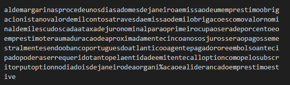

- Este CTF tem como objetivo decifrar um criptograma fornecido no repositório git, sem acesso à chave utilizada na sua criação.
- Para tal, utilizamos o editor Visual Studio Code de modo a converter cada caracter especial numa letra do alfabeto, por exemplo, transformar todos os "." em "a", os "=" em b, etc.
- Após a conversão de todos os caracteres em questão obteve-se o seguinte:

*Fig. 1 - Texto convertido a letras*

- Em seguida, utilizamos o site https://www.guballa.de/substitution-solver, que tem como objetivo resolver criptogramas. Ao fornecer como input o criptograma da imagem acima obteve-se o seguinte texto:

*Fig. 2 - Texto 'decifrado' obtido*

- De notar que a descodificação não foi 100% eficaz.
- Por fim, tendo em mente que grande parte dos caracteres do texto obtido em cima correspondem aos caracteres do criptograma que nos foi fornecido inicialmente, fizemos a correspondência dos caracteres especiais da flag com a respetiva letra do alfabeto.

*Fig. 3 - Correspondências obtidas*
