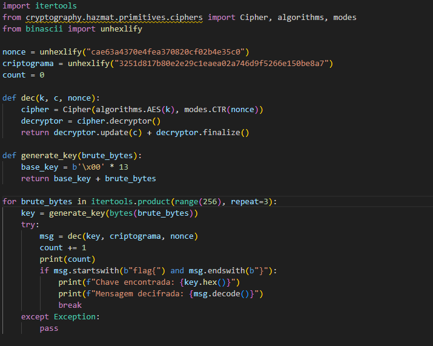
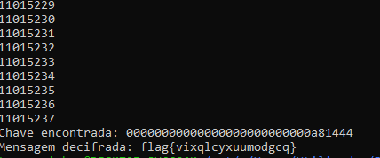

### Task1

- Para começar este desafio analisamos o ficheiro fornecido (cipherspec.py). Observamos, então, que este contém um grande problema, mais precisamente, o uso de um offset fixo. Este offset torna a cifra menos segura, já que como este é igual a 3, os 3 primeiros bytes são iguais a 0 e os últimos 3 são aleatórios, num total de 13 bytes. Isto implica que existem apenas 2^24 (16777216) chaves possíveis.

**Q:** Como consigo usar esta ciphersuite para cifrar e decifrar dados?

**R:** Este ciphersuite pode ser utilizado para decifrar e cifrar dados, já que:
 
    - permite gerar uma chave com a função gen();
    - permite cifrar com a função enc(key, mensagem, nonce);
    - permite decifrar com a função dec(key, criptograma, nonce).

 **Q:** Como consigo fazer uso da vulnerabilidade que observei para quebrar o código?

**R:** Esta vulnerabilidade implica uma redução no espaço de chaves para 2^24, facilitando um ataque brute force que procura uma mensagem do tipo "flag{mensagem}".

 **Q:** Como consigo automatizar este processo, para que o meu ataque saiba que encontrou a flag?

**R:** De modo a automatizar o processo, criamos um script que nos permitiu gerar chaves onde apenas os últimos 3 bytes variam, que posteriormente são utilizadas para decifrar o criptograma, validando o resultado ao verificar se a mensagem é do tipo "flag{mensagem}", terminando assim que a encontrar.

*Fig. 1 - Script criado*

### Task2

- Para invalidar este ataque durante 10 anos, é necessário ter em conta algumas estatísticas:
    - nº tentativas em 10 segundos = 43902 (aproxidamente 4390 por segundo);
    - segundos em 10 anos = 10*365*24*3600=315360000 segundos;
    - tentativas possíveis 4390*315360000 = 1,385*10^12.

**Conclusões**

- espaço de chaves exigido = 2^(8*offeset) > 1,385*10^12  -> offset=5,04.
- Isto implica que para tornar o ataque brute forte inviável durante 10 anos é necessário um offset de 6 bytes (2^48) chaves.

### Task3

- A ideia do autor de usar o nonce com 1 byte de tamanho não seria eficaz, já que o espaço de busca é limitado (nonce de 1 byte implica 2^8 (256) valores possíveis), o que leva a um aumento do esforço do ataque num fator de 2^8 (para cada chave 256 nonces adicionais). 
- Por outro lado, como o nonce é muito pequeno (1 byte) torna-se suscetível a colisões, o que torna a cifra insegura, já que reutilizar o mesmo nonce com a mesma chave em AES-CTR torna o sistema vulnerável. 
- Assim, concluimos que o ataque mantém-se viável, visto que para 2^24 chaves e um nonce de 1 byte existem apenas 2^32 combinações, um valor acessível para brute force.

## Resultados

- Enquanto respondiamos às questões deste desafio, deixamos o nosso código brute force a correr em segundo plano, obtendo a seguinte flag:

*Fig. 2 - Flag encontrada*
