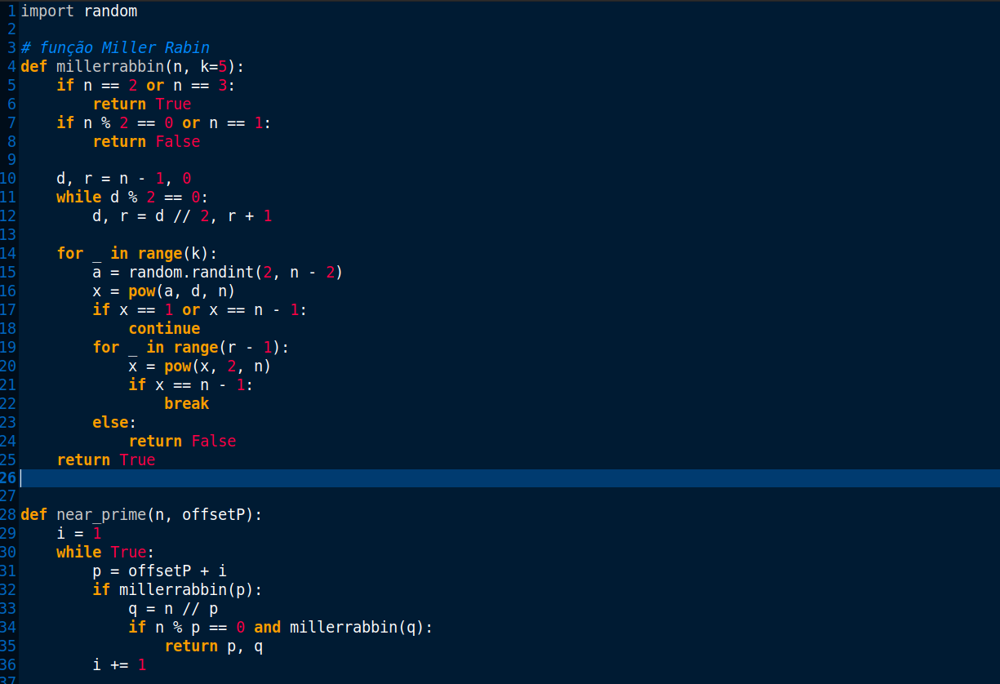
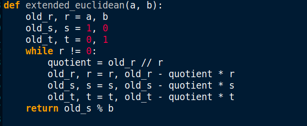
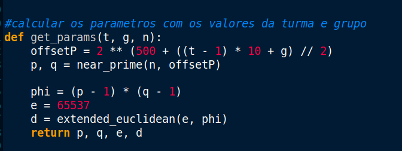
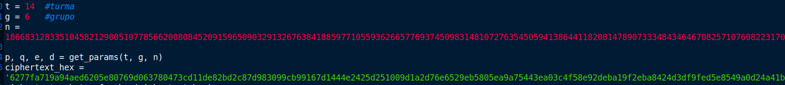
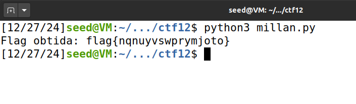

- Neste desafio foi nos pedido para explorar o problema de fatorizar um módulo de RSA com conhecimento parcial dos primos utilizados para o calcular.

- Com isto em mente foram nos fornecidos um expoente público, um módulo(n) e um criptograma em hexadecimal.

```
Expoente público: 65537
Módulo: 
1866831283351045821290051077856620080845209159650903291326763841885977105593626657769374509831481072763545059413864411820814789073334843464670825710760822317079604277696892281311567379610341134785096589277223335138186754016883694565306209545128121773668441148613145778406720571779166001536135740359264426860049639949882305858153158973007007991
Criptograma: 6277fa719a94aed6205e80769d063780473cd11de82bd2c87d983099cb99167d1444e2425d251009d1a2d76e6529eb5805ea9a75443ea03c4f58e92deba19f2eba8424d3df9fed5e8549a0d24a41bcd9975beac88f461f1f62ebdf980fd6e4a8e1202a06d8218d9f2f59864efcc068e2b3950a19ec3fefab1601eab84b2dfdfde080ecd15f98be67f613bebcc74c000000000000000000000000000000000000000000000000000000000000000000000000000000000000000000000000000000000000000000000000000000000000000000000000000000000000000000000000000000000000000000000000000000000000000000000000000000000000
```

- Para começar decidimos apofundar o nosso conhecimento do RSA.
- O algoritmo RSA utiliza dois números primos grandes 𝑝 p e 𝑞 q para gerar as chaves criptográficas. A chave pública é baseada no produto 𝑛 = 𝑝 ⋅ 𝑞 n=p⋅q, enquanto a chave privada usa propriedades da função totiente de Euler 𝜙 ( 𝑛 ) = ( 𝑝 − 1 ) ( 𝑞 − 1 ) ϕ(n)=(p−1)(q−1). A segurança do RSA depende da dificuldade de fatorar 𝑛 n para descobrir 𝑝 p e 𝑞 q, tornando-o eficaz para criptografia assimétrica.

```
p é um primo próximo de 2^500+(((t-1)*10 + g) // 2)
q é um primo próximo de 2^501+(((t-1)*10 + g) // 2)
```

- Foi nos sugerido utilizar o algoritmo de Miller-Rabin para encontrar os primos.





- Utilizamos a seguinte função para calcular os nossos parametros.



- Os valores utilizados na função a cima encontram-se assim estruturados:



- Finalmente corremos o nosso código e obtivemos a seguinte flag:



## Questões:

**Questão 1**<br> Como consigo usar a informação que tenho para inferir os valores usados no RSA que cifrou a flag?
<br><br>**Resposta**<br> O RSA é um algoritmo de criptografia assimétrica que utiliza uma chave pública representada por (e,n) e por uma chave privada representada por (d,n). A sua segurança baseia-se na dificuldade de fatorizar n nos números primos p e q, que o compõem ( n = p ⋅ q n=p⋅q). A partir de p e q, calcula-se v = ( v − 1 ) ⋅ ( q − 1 ) v=(p−1)⋅(q−1), permitindo determinar d, tal que d ⋅ e ≡ 1 m o d v d⋅e≡1modv, o que possibilita a descoberta da chave privada.

**Questão 2**<br> Como consigo descobrir se a minha inferência está correta?
<br><br>**Resposta**<br> Como referido na questão anterior, a chave privada é composta pelos valores d e n. Ao determinar os números primos p e q (valores únicos), é possível calcular 𝑣 = ( 𝑝 − 1 ) ⋅ ( 𝑞 − 1 ) v=(p−1)⋅(q−1), que também é único. Com v, o valor de d pode ser definido de forma única para um dado e. Assim, ao obter corretamente todos os parâmetros, a inferência torna-se válida, já que o conjunto de valores é exclusivo.

**Questão 3**<br> Finalmente, como posso extrair a minha chave do criptograma que recebi?
<br><br>**Resposta**<br> Com o valor de d, é possível decifrar o texto. Basta converter a mensagem cifrada num número inteiro, elevalo à potência  d e calcular o módulo de n:  M=C d modn.