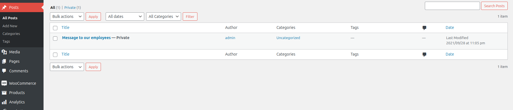

- Ao entrar no site, a primeira coisa que fizemos foi descobrir as versões e plugins do mesmo, descobrindo a primeira através de uma inspeção rápida ao código HTML da página, sendo estes 5.8.1 para o WordPress e 5.7.1 para o WooCommerce.

*Fig. 1 - Versão do WordPress e WooCommerce*

- A seguir, de forma a descobrirmos os plugins, ainda na página de código fonte do site, procuramos por plugins e descobrimos dois principais junto das suas versões, woocommerce e mstore-api.

*Fig. 2 - Plugins e as suas versões*

- Finalmente, para terminar a fase de recolha de informação, encontramos os users observando a página principal do site onde mostra comentários recentes revelando um user "admin" e outro "Orval Sanford".

*Fig. 3 - Users*

- Acabando de reunir informação, tentamos procurar algum CVE relacionado ao WordPress, WooCommerce e aos plugins, em várias bases de dados como ExploitDB e CVEdetails, porém não encontramos nenhum que nos parecesse funcional ou apropriado.

- Após isso, com uma rápida pesquisa no Google sobre o plugin mstore-api numa tentativa extra de encontrar algo acabamos por descobrir um repositório no github com um CVE que parecia ideal, o CVE-2023-2732, ao que tentamos submeter no primeiro desafio CTF e conseguindo completar o mesmo.

- Este CVE aproveita-se de uma falha de verificação suficiente, por parte do plugin MStore API, no usuário a ser fornecido. Isto torna-o vulnerável a uma ultrapassagem de autenticação em versões até 3.9.2, e permitindo que dessemos login como qualquer usuário existente no site, assumindo que temos acesso ao seu id.

*Fig. 4 - CVE para o plugin mstore-api*

- Usando um script de python contido no github que tinhamos encontrado anteriormente, descobrimos o id do admin e usando o mesmo obtivemos um link que nos permitiu dar login no site como admin.

*Fig. 5 & 6 - Exploit e acesso à conta admin*

- Tendo feito isto só restou explorarmos a dashboard de admin, até que encontramos a secção de posts, onde havia um privado que continha a flag de resposta para a segunda parte do desafio.

*Fig. 7 & 8 - Localização da flag final*