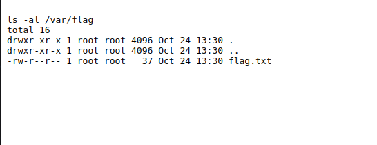

- Ao entrar no site, tendo em conta a informação que nos foi dada, de que o backend do site corre em linux, verificamos de que modo isto acontecia. Deparamo-nos que a pesquisa utiliza o cgi-bin, enviando a informação para a list.cgi. Notámos também que quando pesquisávamos algo o comando "ls -al" era executado. Com isto em mente pesquisámos pelo CVE e concluímos que este seria o CVE-2014-6271.

*Fig. 1 - Código fonte do site em HTML*

*Fig. 2 - Pesquisa de diretórios*

- Este CVE é bastante conhecido, tendo o 'nickname' "Shellshock", que consiste numa vulnerabilidade na GNU Bash Shell que permite a execução de comandos, mesmo sem permissão. Isto é possível porque quando a Bash encontra uma função SET-UID com variavéis de ambiente ela processa toda a string. Consequentemente, comandos após esta função são executados com permissões root.

- Depois de termos encontrado o CVE, explorámos melhor o site, até que encontrámos uma pasta com o nome 'flag', no path /var. Entrando na pasta verificámos a existência do ficheiro flag.txt. Agora bastava ler este ficheiro, o que foi uma tarefa simples, já que tinhamos descoberto o CVE. Pesquisámos pelo path absoluto do ficheiro (/var/flag/flag.txt;) e demos um cat, antecedido por um (;) de modo a manter as permissões do ls, para dar print ao contéudo do ficheiro (cat /var/flag/flag.txt;).

*Fig. 3 & 4 - Exploração dos paths*

- O comando final, tendo em conta o ls -al escondido, que revelou a flag foi então : /var/flag/flag.txt; cat var/flag/flag.txt;

*Fig. 5 - Flag found*