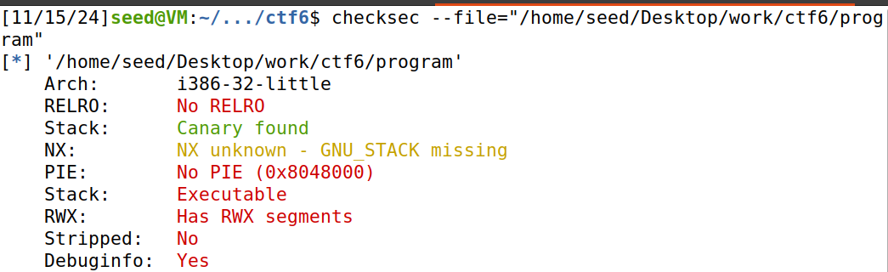
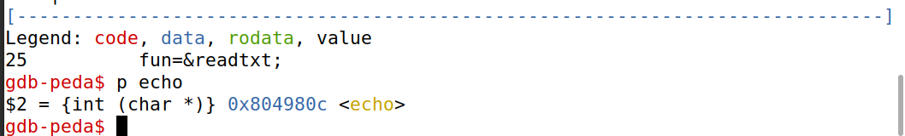
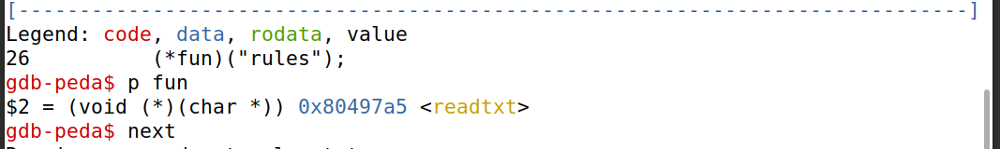
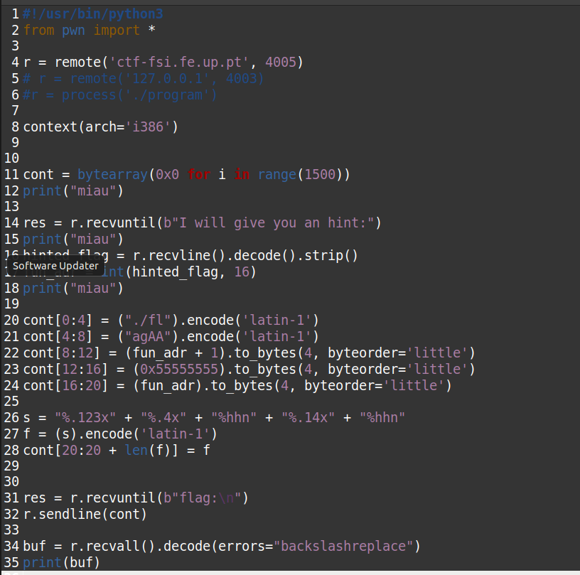
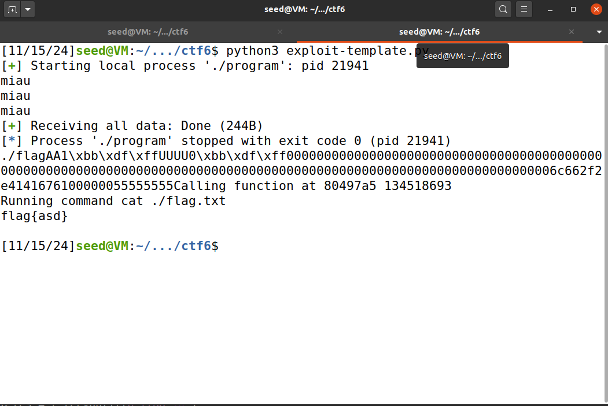
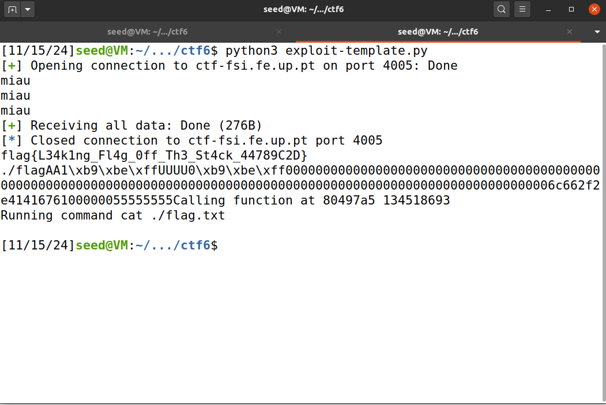

- Com base no checksec concluimos que as defesas ativas são o Stack Canary e o Debug Information. Com isto os ataques possíveis incluiriam Ret2Libc (onde se insere o nosso Format String Exploit), ROP, GOT Overwrite e Injeção de ShellCode.

*Fig. 1 - Proteções verificadas*

- Antes de proceder para a resolução do desáfio foram nos propostas as seguintes questões:

Q1: Existe algum ficheiro que é aberto e lido pelo programa?

R1: Sim, já que o programa lê um arquivo através da função readtxt, que executa um cat que lê o ficheiro com o nome passado como argumento.

Q2: Existe alguma forma de controlar o ficheiro que é aberto?

R2: Depende, já que diretamente o programa chama readtxt("rules") sem interação do usuário. Por outro lado, isto pode ser contornado ao utilizar a vulnerabilidade, de format string, do echo. Isto permite-nos utlizar especificações, como o %x, para explorar o contéudo em memória.

Q3: Existe alguma format string? Se sim, em que é vulnerável e o que podes fazer?

R3: Como respondido na questão anterior, sim, existe uma vulnerabilidade de format string na função echo. Com isto em mente podemos aproveitar que o scanf lê diretamente o valor inserido pelo usuário(controlado pelo valor de str) no buffer e a função echo usa printf para exibir str, sem qualquer tipo de validação/confirmação.

### Seguindo agora para o ataque...

- O endereço do pointer 'fun' é fornecido pelo código ao correr o mesmo e o da função 'readtxt' é descoberto usando o debugging do gdb, obtendo então o valor 0x80497a5. 
Como os endereços são bastante próximos só precisamos de alterar os dois bytes menos significativos.

*Fig. 2 - Endereço encontrado do 'echo'*

*Fig. 2 - Endereço encontrado do 'readtxt'*

- Com isto em mente, alterámos o ficheiro exploit.py, de modo a mudar o pointer para a função readtxt, que será executada com ./fl como parâmetro. O payload foi alterado de modo a ser constituido pelos primeiros 6 bytes, que lêm a flag, os 8 próximos  ocupados por valores aleatórios, seguidos do valor do endereço da função em fun + 1 para escrever o valor 0x97(=151), seguido de um padding de 4 bytes aleatórios que serão lidos pelo '%x', o endereço da função em fun para escrever o valor 0xa5(=165) e dois '%x' de forma a ignorar os primeiros 8 bytes da stack. 
- Finalmente, utilizámos %hhn para alterar os valores nos endereços de fun e fun + 1 para 0x97 e 0xa5, respetivamente, e, entre eles, %x de modo a acertar o número de bytes, permitindo assim a escrita do próximo byte.

*Fig. 3 - Exploit construído*

- Correndo o script localmente, verificámos que o código funciona, obtendo a flag de teste:

*Fig. 4 - Execução do exploit local*

- Correndo o script de forma remota obtivemos então a seguinte flag:

*Fig. 5 - Execução do exploit remotamente*