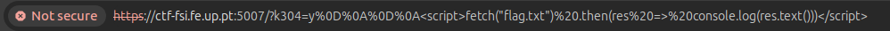

- Para começar este desafio explorámos a página como um utilizador normal e estudámos os pedidos HTTPS. Depois de uma breve análise, verificámos que nestes pedidos o parâmetro ?k304 era utilizado.

*Fig. 1 - Parâmetro encontrado*

### Task 1

- Concluimos também que o ficheiro referente à flag não era acessível diretamente, já que este o ficheiro pode não ser um arquivo estático, ou seja, o servidor gera o seu contéudo de forma dinâmica (por exemplo apenas 'requests' que contenham um 'fetch' geram a flag).

### Task 2

- Com isto em mente pesquisámos por vulnerabilidades neste serviço, relacionadas com os pedidos HTTP, GET e POST, que utilizam o parâmetro ?k304. Encontrámos então o CVE-2023-38501, que definitivamente nos ajudou!!

*Fig. 2 - CVE encontrado*

### Task 3

- Após analisar este CVE, concluimos que a vulnerabilidade de XSS é do tipo Reflected.

- Para descobrir a flag, utilizámos então o seguinte endereço com JavaScript codificado:

*Fig. 3 - URL com JavaScript codificado*

- Que se for descodificado traduz-se no seguinte:

*Fig. 4 - URL com JavaScript descodificado*

- Finalmente inspecionámos a consola da página que acedemos e obtivemos a seguinte flag:

*Fig. 5 - Flag final obtida*