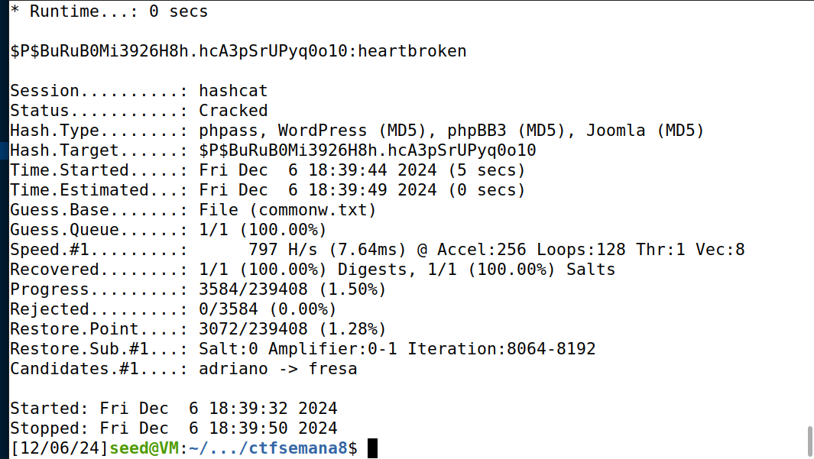

- Tal como no desafio anterior de WordPress, começámos por analisar o website, concluido que este utiliza a versão 6.7.1 do Wordpress. Com uma análise mais detalha dos plugins e pesquisa sobre possíveis vulnerabilidades dos mesmos, concluímos que o plugin NotificationX seria vulnerável.

*Fig. 1 - Versão da WordPress*

- Com isto em mente pesquisámos por possíveis vulnerabilidades conhecidas, o que nos levou ao CVE-2024-1698. Para este CVE encontrámos o seguinte exploit:

https://github.com/kamranhasan/CVE-2024-1698-Exploit

- Tendo em conta a nossa pesquisa sobre o plugin NotificationX, é importante notar que este plugin constrói dinamicamente consultas SQL causadas por input de usuários, sem quaisquer tipo de controlo (o que nos permite abusar deste exploit).

- Procurámos pelo endpoint vulnerável, guaidos pelo README do repositório onde encontramos o exploit, obtendo o seguinte: "wp-json/notificationx/v1/analytics".

*Fig. 2 - Informação do endpoint vulnerável*

- Ajustamos então o ficheiro exploit.py, de modo a ter o nosso URL. Alteramos também o delay(função que controla o intervalo de espera entre respostas do servidor) para 2.5 segundos.

**Nota:** Com toda a informação até ao momento, foi possível concluir que esta vulnerabilidade classifica-se por Neutralização Inadequada de Elementos Especiais em  Comandos SQL, ou seja, CWE-89, uma fraqueza que pode comprometer a base de dados e/ou dando controlo ao atacante.

*Fig. 3 - Ficheiro exploit.py alterado*

- Agora, com o script, conseguimos finalmente injetar SQL, obtendo assim inforação sensível da base de dados (username e password(hashed) do admin). 

**Nota:** a wordpress utiliza nas suas hashes a técnica PHPass.

*Fig. 4 - Início de execução do exploit.py*

*Fig. 5 - Final da execução do exploit.py*

- Agora basta decifrar a password que se encontra hashed. Métodos de brute force ou dicionário tornam possível a obtenção da password original, pelo que palavras fracas são ainda mais fracas. No nosso caso utilizamos o Hashcat para obter a password por método de dicionário.

- Corremos então o seguinte comando, que utilizou dois ficheiros, hashed.txt e commonw.txt, que contêm a hashed password e uma lista de passwords comuns, respetivamente. O m 400 especifica a técnica de hashing PHPass.

**Nota:** commow.txt é contém uma porção do rockyou.txt.

*Fig. 6 - Comando HashCat*

- Após a execução do código obtivemos o seguinte resultado:

*Fig. 7 - Password obtida*

- Concluindo assim que a password do admin é heartbroken.
