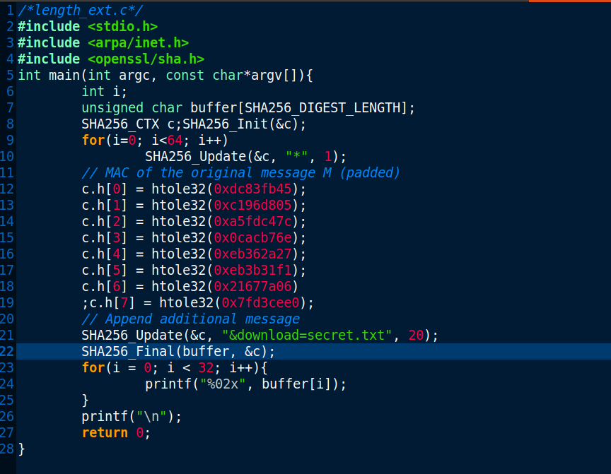

# Trabalho realizado na semana 10

### Task 1 

- Nesta primeira task , começámos por escolher um par id key, mais precisamente, o id 1002. Com isto em mente, utilizámos o seguite comando de forma a obter o mac com esta informação.

- Com esta informação construímos o URL base para listar os diretórios, tendo em conta o nome de um dos nossos membros, o id do utilizador e a key.

- Entrando assim no site:

- Refletindo os passos anteriores, criámos um URL para ler o ficheiro secret.txt.

### Task 2

- Nesta task contruimos o padding para a messagem M, seguindo os seguintes passos:

### Task3

- Nesta task obtivemos novamente o MAC "base" do site.

- Este MAC foi utilizado pelo ficheiro length_txt.c de forma padded. Este ficheiro tem o intuito de gerar um novo MAC, tendo em conta a mensagem extra, "&download=secret.txt".

- Compilando e executando o programa obtivemos o seguinte MAC:

- Desta forma, o URL ficou com o seguinte formato:

http://www.seedlab-hashlen.com/?myname=TiagoPinheiro&uid=1002&lstcmd=1%80%00%00%00%00%00%00%00%00%00%00%00%00%00%00%00%00%01%68&download=secret.txt&mac=579eb8416688f5c399dac3ad1d2bafbd08641b4b5f5d9747dc31e7fe2946a66b

- Finalmente, entrando no site obtivemos a seguinte página:

