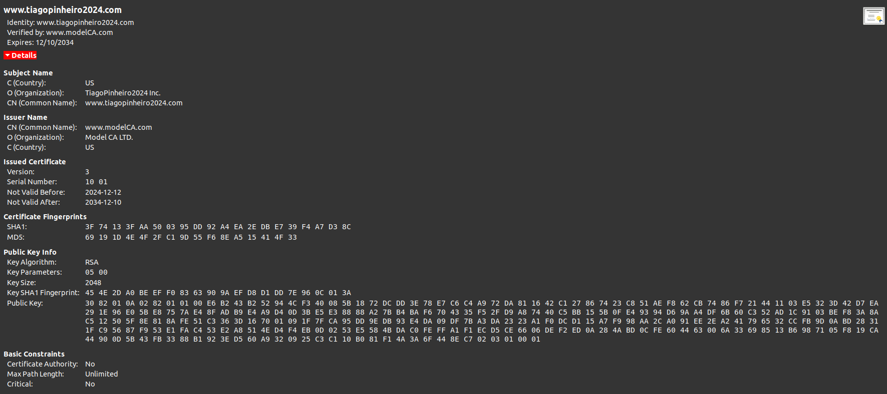

# Trabalho realizado na semana 11

- Antes de começar esta experiência, corremos o comando docker-compose up, e em seguida, adicionamos a seguinte linha ao ficheiro /etc/hosts na nossa virtual machine:

*10.9.0.80       www.tiagopinheiro2024.com*

## Questão 1

### Task 1

- Inicialmente, copiamos o ficheiro /usr/lib/ssl/openssl.cnf para o nosso diretório Labsetup. Posteriormente, criamos o diretório demoCa que iria conter um outro diretório dentro dele, newcerts, um ficheiro vazio, index.txt, e um ficheiro serial com um único número em formato string (1000).
- Em seguida, corremos o seguinte comando para gerar o certificado CA


- Dois ficheiros foram gerados, ca.key, que contém a CA private key, e ca.crt que contém o certificado da chave pública.
- O conteúdo do certificado pode ser obtido com o seguinte comando:


- O conteúdo da chave pode ser obtido com o seguinte comando:


- Sabemos que é um certificado CA, já que existe na secção basic constraints um atributo certificate authority verdadeiro.


- O certificado é self-signed pois o campo issuer e o campo subject são iguais.


- O seguinte ficheiro permite identificar os seguintes elementos:
    - prime1
    - prime2
    - modulus
    - publicExponent
    - privateExponent
    - coeficient

```
modulus:
    00:e8:f9:55:bc:f6:2e:23:0f:52:fe:2f:c0:09:9a:
    c5:fb:53:d1:aa:45:7a:a1:45:61:ee:8b:c0:f1:a8:
    4b:62:4d:07:f4:12:57:07:f0:cf:ca:44:e6:46:cf:
    2d:fa:78:53:05:c7:13:67:9c:c7:ca:22:ed:43:71:
    5f:48:46:c0:b9:df:18:49:28:3c:16:ac:38:b1:8e:
    d5:48:fa:41:0c:09:5b:6a:cd:6c:e5:f1:c4:f8:18:
    9d:25:b5:16:e0:b5:ae:a5:87:0e:b3:d1:a2:d2:2e:
    b0:6f:24:f2:00:e4:4b:f4:2d:ce:3a:1f:52:8a:bd:
    c0:16:d9:a7:14:68:04:b2:cf:1e:b5:f8:40:08:d3:
    9a:0a:e8:cf:42:3a:c6:fe:3b:95:66:8d:94:76:f8:
    42:1f:da:f4:15:68:07:48:a8:13:6f:0c:3c:5c:b4:
    f1:dc:c1:dc:7a:17:f0:48:61:86:9d:7f:a2:23:0f:
    ac:21:f8:96:6d:c4:aa:ac:c0:22:12:fe:23:16:86:
    4b:84:e6:7a:84:c5:fa:ec:bf:6d:2f:2f:29:4e:0d:
    64:41:dd:5a:b2:e1:bb:a1:f9:ae:67:be:d5:f1:54:
    15:18:a2:ff:66:f3:15:df:56:43:8f:64:8c:f1:1a:
    b3:18:13:b5:f6:ea:84:d9:a8:f9:ee:95:01:e5:ba:
    0f:f8:66:3e:17:11:44:ee:9c:2b:39:8c:a5:2d:b4:
    a0:bb:e1:21:74:dd:8e:e7:86:93:a2:87:a7:cf:8e:
    ac:51:5a:e8:f0:a7:72:7f:bc:15:31:73:61:b8:da:
    6c:23:84:f0:80:57:24:ea:13:ed:bb:47:d3:db:8a:
    d0:ff:fd:6f:0e:00:25:78:78:48:2b:d8:ba:d6:15:
    1b:c3:6d:b4:fb:f7:69:d9:bf:44:79:3a:6d:99:c0:
    48:6d:35:ed:ac:b9:1d:62:15:8d:0f:b1:e5:1c:fe:
    97:a6:58:12:db:d6:5f:11:e2:47:b3:84:19:65:26:
    cd:23:76:a4:af:50:12:72:99:ed:38:9a:6c:10:cf:
    52:b4:bd:9c:ed:4d:13:1e:cb:d4:cd:cc:70:76:ca:
    70:44:50:21:3a:03:cf:fc:7d:6e:d6:6d:cc:d6:18:
    66:f6:1b:1a:5d:1d:b0:5a:45:58:e5:4a:9d:e3:0a:
    c2:b4:b0:72:eb:55:d7:f5:98:e1:b2:a8:44:7e:bb:
    dc:b6:62:38:fe:33:26:83:71:a0:49:02:d6:2f:2f:
    72:9e:3f:cd:3f:f9:22:4b:64:6d:82:90:51:1b:0c:
    5b:4d:94:70:6c:c4:16:66:01:9f:bf:92:7e:1c:b7:
    dd:cd:03:c3:1d:e3:ea:42:81:a5:25:d8:ab:8a:4f:
    27:10:75
publicExponent: 65537 (0x10001)
privateExponent:
    39:2a:5d:28:65:bb:c2:6c:93:2f:bd:e5:c0:35:93:
    18:ed:63:48:05:8e:66:9e:10:be:a8:da:2a:31:e2:
    75:77:73:59:27:5a:e5:9e:e8:4d:b8:84:4c:a1:af:
    a5:82:fa:d4:33:1a:06:d5:88:8c:87:ef:72:1a:12:
    88:38:9c:37:bf:8f:44:fc:33:6a:58:cd:fc:7b:90:
    c8:3c:67:d3:9d:44:2a:3b:c7:d9:d0:6e:45:76:3c:
    b1:30:f3:31:26:43:79:68:5f:6a:2e:29:66:ab:80:
    2d:75:82:50:47:b4:7f:70:f1:e6:7f:23:10:da:28:
    95:32:c8:f5:8f:e4:7f:3f:a5:48:7f:66:af:03:c5:
    0b:a2:3e:a1:00:ad:2d:5a:cf:78:ff:8a:8b:7a:b5:
    36:fd:d1:e0:a2:cb:0e:bf:f7:2c:cb:72:d0:48:b2:
    04:3a:29:70:68:09:54:a9:61:8f:a9:ee:cd:ed:9d:
    8e:24:62:3d:03:01:e2:2b:ae:f0:bc:1d:3d:fc:ab:
    f1:2b:60:aa:cd:ad:99:84:0b:35:85:bb:fb:e3:fb:
    52:d2:0e:dc:4f:d9:6b:90:49:84:39:66:63:b5:ff:
    0b:31:8b:bb:e6:2f:da:c2:5f:07:83:63:b6:11:98:
    1a:73:53:b6:07:ab:9b:81:03:fa:cf:e3:4c:4c:50:
    78:6a:1c:5e:5a:d0:db:42:38:c7:cf:fd:42:39:0a:
    9a:11:7b:26:30:c2:9e:56:67:2b:40:cf:2b:95:0c:
    b2:d2:96:44:93:c0:1e:60:a8:54:95:b5:a3:1a:53:
    c4:b1:ab:da:95:59:de:a9:12:8f:5f:88:d5:58:31:
    32:8a:64:ef:96:d0:6e:8a:8f:66:93:3f:05:46:8c:
    8b:e3:ec:a8:be:4b:c0:8f:d0:cb:e0:f3:2f:a3:4c:
    87:34:cf:70:dc:c0:24:6f:ae:cb:5d:8d:99:42:9f:
    b8:f9:ba:20:6e:29:31:b5:4c:20:b9:d8:aa:9b:ac:
    5c:53:ff:ad:69:34:2c:de:16:65:3b:d5:04:a6:2b:
    35:22:e6:cb:bf:d1:86:ce:71:5d:77:c2:9a:55:a8:
    7f:fc:ca:40:61:89:94:5b:23:cf:61:b2:49:d3:03:
    04:8a:98:81:39:41:00:ff:8d:68:70:6f:c7:a6:9a:
    5c:de:0d:06:80:b2:36:bc:d7:a1:dd:c0:2b:81:5d:
    94:95:6d:c1:5a:6f:fa:2e:60:71:8c:f5:c2:42:59:
    de:a3:07:b3:d3:41:74:8f:60:57:31:51:2f:28:be:
    05:d7:c6:5b:59:d6:ed:e7:88:61:b9:de:99:04:f0:
    51:18:2b:c3:d0:e7:ed:b9:7c:e6:03:2d:0c:9a:40:
    65:4d
prime1:
    00:ff:aa:88:82:70:73:27:f5:c4:08:1b:dc:3d:36:
    52:49:e5:fc:7a:91:8e:7c:55:ae:f4:df:a7:a4:ce:
    94:24:1e:b7:14:fa:5f:3d:fd:69:9b:9a:7f:01:66:
    b4:98:fc:6f:d0:7e:cb:f3:60:de:db:61:cc:1c:f2:
    c3:e7:99:7c:7a:98:ad:92:46:63:ae:26:e4:9a:c1:
    0d:88:ac:81:a3:e8:2a:e7:8c:08:70:f7:99:d6:46:
    e4:db:83:2f:70:60:7e:80:85:5b:c1:2f:e7:ba:45:
    52:ef:d8:c5:ae:d6:0f:95:2e:76:52:40:1f:c1:61:
    b3:55:df:d2:3d:31:d2:0a:80:93:8b:34:7a:12:04:
    a9:b8:86:c8:49:16:fd:79:88:c1:83:ba:a1:98:ed:
    83:bc:48:4b:7d:c8:e6:3e:5a:60:ad:8b:1e:a4:58:
    37:41:21:f0:28:ca:3c:36:0a:35:6e:da:83:ac:d6:
    f3:b1:3c:33:3b:8d:08:18:81:48:a2:60:ce:f0:82:
    de:72:fb:41:92:49:9e:3c:10:0f:2d:3a:2c:6a:b0:
    8f:48:6a:bb:91:e5:84:77:93:be:7e:4e:1c:6f:d1:
    31:9f:ca:b2:b1:c1:16:cf:20:23:70:43:d0:50:1f:
    d4:46:8f:d0:58:9a:ef:d5:19:8b:90:8b:d3:9a:06:
    d4:33
prime2:
    00:e9:47:37:44:d5:4f:11:c3:38:88:bc:ec:f2:50:
    f8:b4:74:f5:e1:7d:01:05:71:33:95:ed:5a:74:43:
    d9:25:e5:e3:e4:c2:f2:33:d5:60:7e:52:d3:84:b2:
    bb:4b:c7:8c:c1:fd:3e:92:62:ec:16:39:05:e0:8a:
    fa:ff:51:0e:38:ed:f5:7f:b9:c6:b9:28:97:24:64:
    72:3a:cc:52:dc:d9:f1:43:eb:42:9b:d9:ce:14:20:
    47:e7:f1:f3:ed:ad:c3:38:84:cb:fd:2c:5e:29:09:
    36:df:55:93:ac:a4:b1:e6:7c:15:0f:f3:36:65:09:
    c1:a9:57:6d:52:46:6e:40:30:76:db:92:11:2c:33:
    a4:d0:c6:c2:93:7a:60:85:a2:69:85:a1:fa:d2:9e:
    27:bb:0d:97:25:30:c8:12:16:ca:b4:6f:10:0e:55:
    c8:f7:67:97:fd:9a:6a:a7:b6:9b:e5:e2:69:fa:a1:
    a0:2a:1e:46:27:f0:ac:78:44:8b:3d:9f:67:7e:eb:
    a6:70:e2:27:ec:0f:96:bc:a1:2e:65:d9:a9:c7:00:
    29:07:2b:e6:67:60:4f:e6:01:c3:27:09:05:3c:31:
    3c:dd:42:32:5b:04:4c:b0:c8:57:6f:fd:27:5e:3f:
    ae:b4:bf:db:06:73:56:a9:c3:f3:0c:13:2c:38:45:
    20:b7
exponent1:
    5b:cb:f4:45:b9:70:6f:79:9b:d0:39:88:a3:65:dc:
    b7:f1:de:ec:77:54:cc:a9:cb:2e:db:1b:0b:5e:ac:
    ec:27:27:1f:5e:22:52:54:a9:d5:97:ec:60:29:6b:
    50:be:da:ba:e6:bb:fd:ff:db:24:b4:01:a0:a7:3d:
    d5:eb:53:39:85:96:54:bd:f7:4e:71:62:85:7a:29:
    8c:d8:3b:98:09:65:56:4b:fe:3f:e9:77:0f:eb:d6:
    82:46:a1:02:dd:72:ae:5c:b3:ac:32:b2:26:3c:7b:
    e1:e8:58:5a:45:3b:c5:19:b0:9c:29:af:fd:34:42:
    3a:e4:29:4d:95:94:cf:f6:88:83:63:ed:2c:89:06:
    13:5e:39:8d:9c:b6:98:2b:95:27:e2:1b:e1:97:ee:
    43:ed:45:45:bd:9b:85:e9:d7:6a:98:58:01:34:37:
    6a:a8:6f:dd:85:77:87:03:b5:59:bf:15:a6:3a:6b:
    b7:48:61:30:d1:9b:85:88:ed:f6:77:81:f5:f3:57:
    41:bb:9b:38:96:3c:3d:5e:9a:c4:67:6d:c9:44:e9:
    bd:5b:ad:4b:5e:38:68:e2:e0:73:e3:41:ec:98:15:
    14:45:a8:51:90:7d:cb:12:c4:06:ac:22:a0:92:3d:
    1a:b4:ca:5e:f6:0a:84:de:2e:31:51:33:41:cb:8f:
    e7
exponent2:
    5a:e7:e0:b6:d7:35:37:e3:ce:ad:22:8a:67:a7:7c:
    33:be:7c:6f:01:aa:9b:37:50:f5:f5:07:d1:d4:fa:
    d3:14:f2:29:1c:7b:0c:0d:f3:cb:66:75:7c:f9:b5:
    99:43:4b:2b:f1:87:27:be:9a:e7:d2:12:e3:3c:e5:
    b1:07:22:36:b7:2c:7b:38:a7:23:52:99:0b:9a:85:
    15:3a:b8:73:ce:0e:81:fc:34:f9:cc:f7:cc:ca:03:
    9b:74:a3:2d:15:10:c5:7e:a2:8b:a7:75:8e:22:44:
    1a:e6:1b:65:24:cd:1a:d7:71:d1:c4:62:87:1f:35:
    33:cb:99:13:7d:d4:ca:f8:d7:e8:9a:d4:4c:58:57:
    ba:f0:29:b5:14:f4:76:3f:23:45:eb:28:76:59:21:
    7c:78:40:55:42:dc:44:88:53:37:db:2b:f3:9a:24:
    75:9d:0e:12:ca:d1:13:48:4b:1a:5b:90:17:16:52:
    f6:f6:d3:3a:0f:44:f6:9d:27:71:bd:23:b4:c7:1a:
    16:55:5b:5f:57:77:d3:4c:30:6b:8a:55:e9:f1:bb:
    0b:4b:65:3f:15:be:2d:10:b4:bf:0a:79:da:ca:09:
    40:e3:e2:01:ab:fc:42:cb:df:9f:09:95:04:da:66:
    37:93:a8:43:ac:40:b2:69:64:d6:68:c6:4b:ab:4c:
    a3
coefficient:
    0a:27:f9:ac:8c:35:a7:c7:41:c7:c0:e3:84:54:7f:
    6f:96:68:47:78:ff:21:59:1b:27:91:a3:2c:33:f5:
    6b:78:01:82:74:41:4b:62:41:1f:a2:b8:4a:7b:a2:
    57:3d:4a:4a:35:f9:1e:ce:5c:9b:78:77:43:bc:1a:
    75:ff:04:99:89:60:fe:56:13:1a:f6:b0:7f:2b:87:
    8b:e7:dd:7f:5f:97:fb:2a:fc:45:25:05:fc:84:5a:
    f2:dc:3c:1d:d4:e1:80:ee:09:f0:ac:d2:b7:2d:97:
    01:43:6d:87:7c:b9:59:9c:da:0b:75:a6:06:30:29:
    16:58:66:b7:6e:66:d7:08:fc:06:54:7d:8a:5a:ff:
    8a:6b:a7:41:ca:2d:1c:ed:80:fe:23:91:dc:2e:4d:
    77:33:4d:81:94:03:06:2b:28:2a:09:99:11:0a:02:
    d2:a5:7b:27:3a:f2:2d:f9:db:fe:10:4f:8d:88:3b:
    68:fe:3a:8e:fe:30:7c:41:74:da:68:ad:6d:bb:97:
    b1:ef:44:11:1a:75:3b:80:7a:f6:25:91:a4:54:3c:
    99:46:a6:56:6f:f3:f9:bc:12:e1:bf:ae:7b:aa:2e:
    0a:e4:37:d5:b6:b4:40:5a:f7:9a:90:6e:1e:7b:b1:
    e5:33:ae:d0:19:9d:ff:52:ec:d9:6a:29:a5:72:e8:
    79
```

### Task 2

- Para começar geramos o certificado para o nosso site:


- Obtendo dois ficheiros, server.csr e server.key.

### Task 3

- Para começar, geramos o certificado do nosso servidor.


- Obtendo o seguinte certificado no ficheiro server.crt:




- De seguida, descomentamos a linha "copy_extensions = copy" e corremos este comando:

*openssl x509 -in server.crt -text -noout*

- No output observamos a presença de todos os nossos nomes.


### Task 4

- Para começar fizemos uma ligeira alteração ao docker file, de modo, a ser coerente com o nosso nome.


- De seguida, criamos o ficheiro tiagopinheiro2024_apache_ssl.conf.


- Finalmente iniciamos o servidor e acedemos ao nosso site de forma insegura.


- De modo a tornar a nossa ligação segura adicionamos o nosso certificado CA às autoridades do nosso browser.


### Task 5

- Para começar alteramos a configuração do servidor para apresentar o site www.example.com.


- De seguida, adicionamos a seguinte linha ao ficheiro /etc/hosts:


- Finalmente, tentamos aceder à páginas e fomos notificados dos riscos, já que o certficado é incoerente (o nome de domínio é diferente do nome de certificado do servidor).


### Task 6

- Para esta tarefa, admitmos que o nosso CA está comprometido. Neste sentido, criamos um certificado para o nosso site malicioso, www.example.com, utilizando os seguintes comandos:


- De seguida, alteramos o ficheiro tiagopinheiro2024_apache_ssl.conf, de forma, a utilizar o nosso novo certificado.


- Finalmente, reiniciamos o servidor e acedemos ao site e verificamos que a ligação já era segura.

## Questão 2

- Um mecanismo eficiente para reagir ao comprometimento de uma autoridade de certificação (CA) é através do uso da certificate revocation list (CRL). A CRL é uma lista mantida pela CA que contém os certificados emitidos pela mesma, mas que foram revogados por terem sido comprometidos ou invalidado por outros motivos. Os sistemas podem consultar a CRL periodicamente para garantir que o certificado em uso ainda é válido.

- No entanto, um adversário pode tentar contornar este mecanismo bloqueando o acesso ao servidor onde a CRL está hospedada, impedindo, assim, a verificação da revogação. Além disso, o adversário pode explorar sistemas mal configurados que não verificam corretamente a CRL. 
