### Task 1 - A

- Nesta task, utilizamos o código fornecido com uma ligeira alteração (valor do iface, que se obteve com o comando ifconfig). Demos permissões de executável ao nosso ficheiro e tentamos executar o programa. Com isto, deparamo-nos que para sniffing é necessário privilégios de root, já que por default não temos qualquer permissão para inicar a socket e, consequentemente, correr o programa.

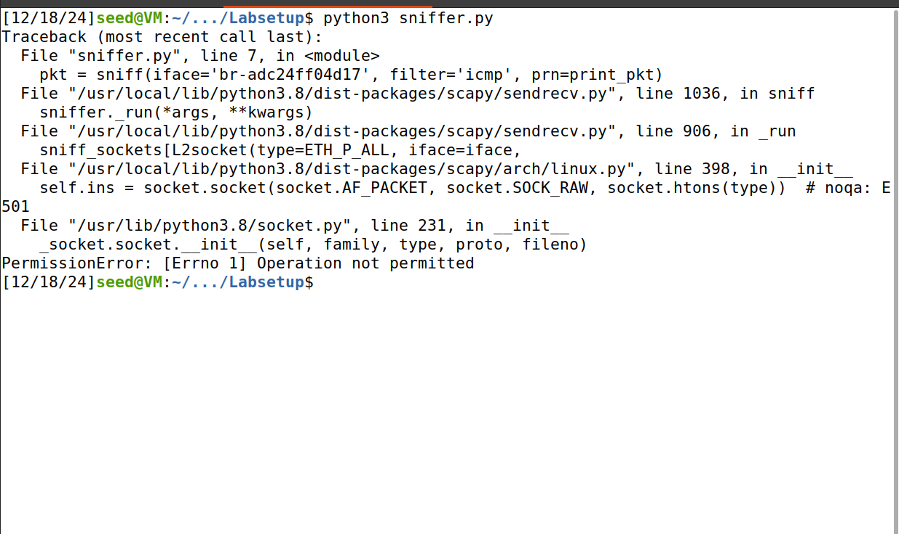

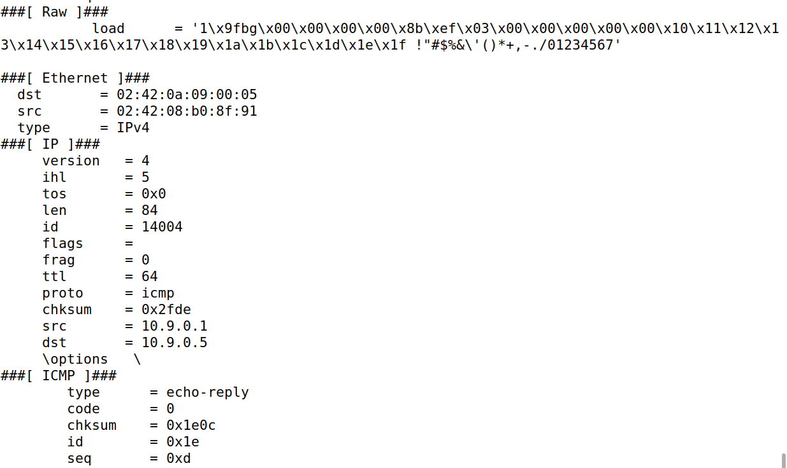

### Task 1 - B

- Nesta task adaptamos o nosso código de diferentes maneiras, de modo, a conseguir capturar tipos especificos de pacotes.

#### 1 - Capturar pacotes ICMP

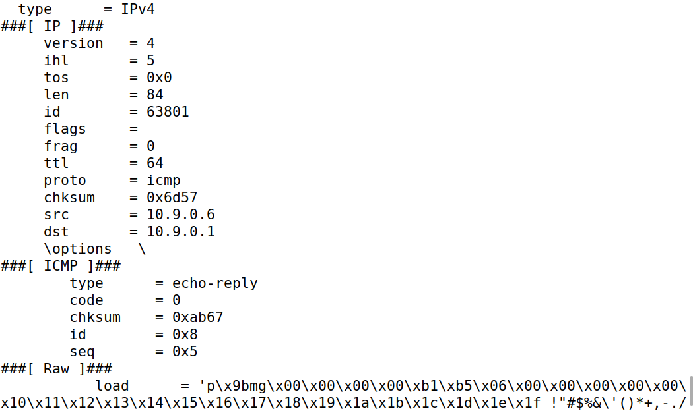

#### 2 - Capturar pacotes TCP que provêm de um determindo IP e porta porta destino número 23

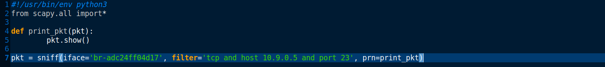

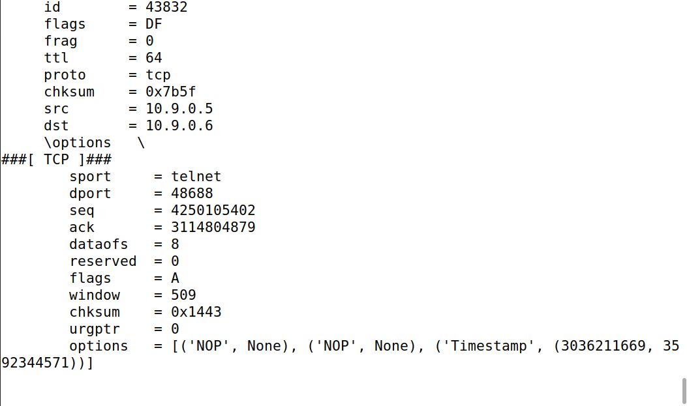

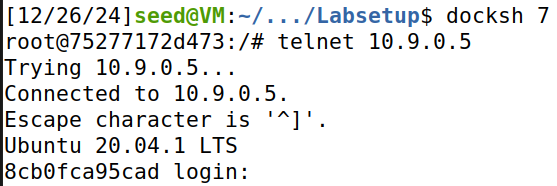

#### 3 - Capturar pacotes de/para uma uma determinada sub rede 

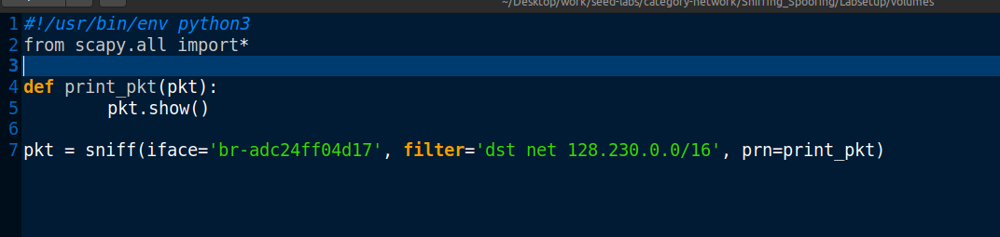

### Task 2

- Nesta task foi nos pedido para fazer spoofing de pacotes ICMP, com um IP de origem à escolha. Utilizando os seguintes comandos.

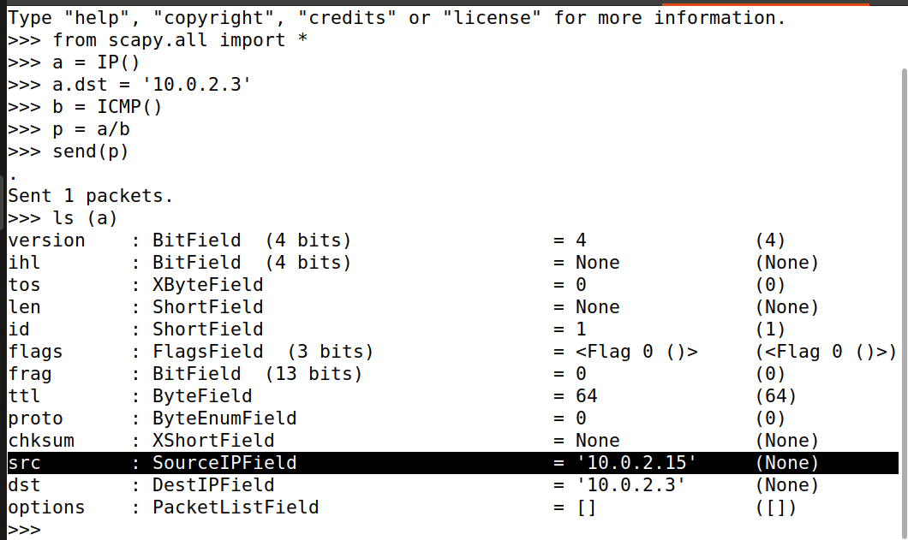

- Com o wireshark verificamos o envio e receção de pacotes ICMP.

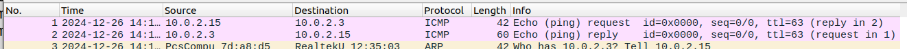

- De seguida, repetimos o processo mas de uma origem à escolha.

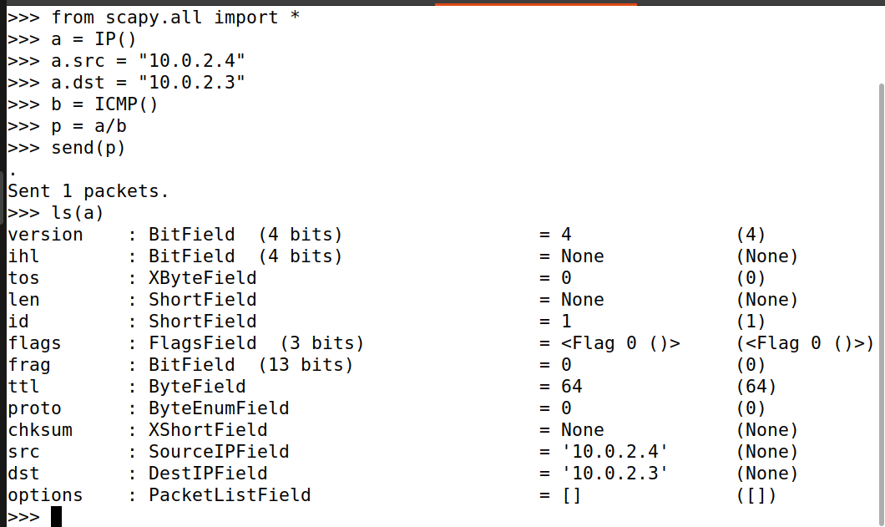

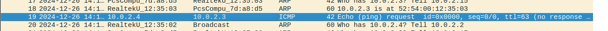

### Task 3

- Nesta task foi nos pedido para estimar a distância, em termos de números de routers, da VM até  chegar ao endereço destino. Com isto em mente, utilizamos pacotes ICMP com valores ttl incrementados.

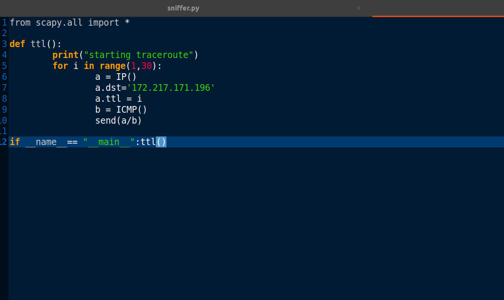

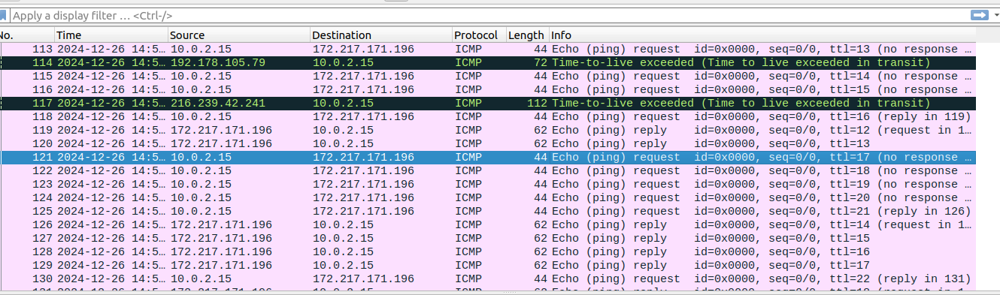

### Task 4

- Para finalizar este lab utilizamos as duas técnicas, sniffing e spoofing. Demos ping a 3 endereços diferentes que, com o wireshark, nos permitiram observar que esta técnica, indica falsamente o estado do destino, independemente do seu verdadeiro estado. De facto, na ótica do cliente A, o servidor 1.2.3.4, por exemplo, é alcansável apesar deste não existir/ser acessível.
- Utilizamos o seguinte código para testar este processo:

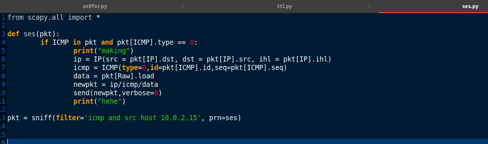

## Resultados obtidos:

- IP 1.2.3.4

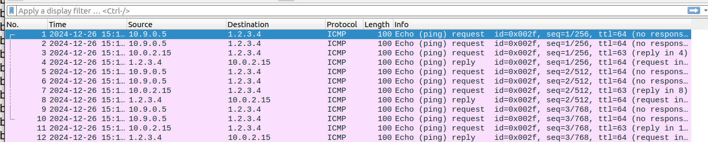

- IP 10.9.0.99

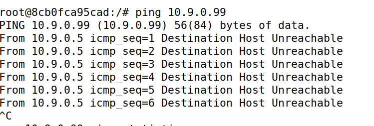

- IP 8.8.8.8

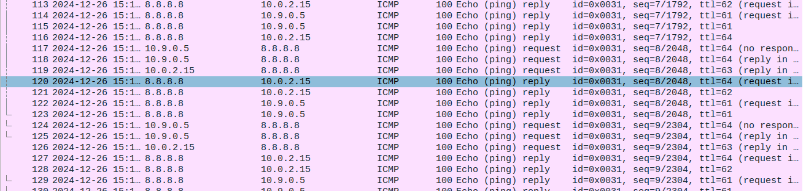