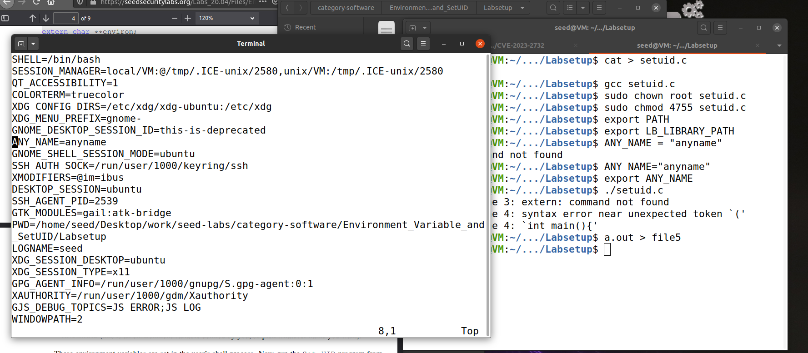

# Trabalho realizado na Semana #4

## 2.1

- printenv -> mostra a lista completa das variaveis de ambiente  (VARIAVEL = valor)

- printenv VARIAVEL -> mostra o valor da variavel ambiente, se esta existir (valor)

- env -> mostra sempre a lista completa de variaveis de ambiente
- env | grep TEXTO -> mostra todos as linhas que contêm TEXTO 

- export -> permite tornar variáveis locais em variaveis de ambiente
- unset -> elimina a variável

## 2.2

### Step 1

### Step 2

- Após compilação e execução do código, obtivemos as variáveis de ambiente do processo filho, criado com o comando fork(). Após a edição sugerida do código
obtivemos as variáveis de ambiente do processo pai. 

### Step 3

- Comparando os dois ficheiros utilizados para guardar os outputs e utilizando o comando diff, observamos que os outputs eram iguais, concluindo, deste modo, que o processo filho herdou as variáveis de ambiente do processo pai. 
- Para verificar que a nossa observação estava correta editámos um dos ficheiros e observamos que, inicialmente, não havia diferenças.

## 2.3 

### Step 1

### Step 2

### Step 3

- Após a compilação e execução do primeiro código fornecido, observamos que o output foi vazio. Isso indica que o novo processo (/usr/bin/env) não herdou nenhuma variável de ambiente. Esse comportamento ocorre porque a função execve() foi chamada com o terceiro parâmetro (a lista de variáveis de ambiente que o novo processo deve herdar) definido como NULL.
- Por outro lado, após a alteração sugerida no código, verificamos que o novo processo (/usr/bin/env) herdou todas as variáveis de ambiente do processo que executou a função execve(). Isso aconteceu porque foi passado, como terceiro argumento, a variável environ, que contém todas as variáveis de ambiente do processo original.

## 2.4 

- Após compilação e execução do código fornecido, verificamos que o novo processo (/usr/bin/env) também herdou todas as variáveis de ambiente do processo que executou a função system().

## 2.5 

### Step 1

### Step 2 & 3

- Depois de mudar a ownership para root e tornar o programa num Set-UID criámos variáveis de ambiente. Destas concluimos que, após corrermos o programa, que apenas o PATH e a ANY_NAME estavam presentes na lista de variáveis de ambiente. Concluindo que por questoes de segurança a variável LD_LIBRARY_PATH foi ocultada.  

## 2.6 

- Nesta etapa, criamos um novo ficheiro e tornámo-lo num programa Set-UID, de modo a executar um comando com um caminho relativo LS. 
- Com isto em mente, criamos um novo ficheiro também chamado ls que dava echo a uma mensagem indicativa do código malicioso. Para que o nosso ficheiro ls fosse executado alteramos o valor da variável PATH de modo a ter no ínicio o caminho absoluto do nosso ficheiro ls. 
- Ao correr o programa Set-UID o output obtido foi a nossa mensagem maliciosa.

## 2.8

### Step 1

- Ao refletir sobre o assunto, concluímos que, se fôssemos o Bob, conseguiríamos comprometer a integridade do sistema, eliminando, por exemplo, um ficheiro que não foi criado por nós. Para isso, criamos um ficheiro hipoteticamente importante, que queríamos excluir, no diretório root, com objetivo de comprometer o sistema. Tornamos, também, o ficheiro catall em um programa Set-UID com permissões de root. Executar o catall normalmente resulta no conteúdo do ficheiro recebido. No entanto, ao tentar remover o ficheiro à força, recebíamos uma mensagem de erro a indicar que as permissões tinham sido recusadas.
- Para resolver este problema, inserimos o comando de remoção (rm -f) como parte do input do executável catall. Assim, além de obtermos o conteúdo do ficheiro, ele também foi eliminado, confirmando que Bob poderia comprometer a integridade do sistema. Isso funciona porque a chamada da função system() cria uma shell onde o comando cat é executado com permissões de root. 

