# Trabalho realizado na Semana #5

## Questão 1

### Tasks 1 & 2

- Para começar, compilámos o programa call_shellcode.c que criou dois binários, a32.out e a64.out.

- De seguida, de modo a compilar o programa vulnerável (stack.c), retirámos as defesas da shell e tornámo-lo num programa root owned SET-UID.

### Task 3

- Para efetuar o ataque, usamos o script de python “exploit.py” que escreve escreve o shellcode para o ficheiro “badfile” que criamos.
O script enche o buffer com instruções NOP e de seguida insere o shellcode na região de memória onde se dá o buffer overflow.

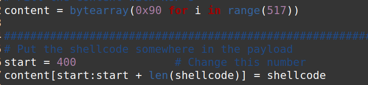

- Depois disso, tentamos adivinhar onde está o shellcode, adicionando 100, 200… ao $ebp. Tendo em conta que não precisamos de corresponder exatamente ao endereço do shellcode, uma vez que, desde que aterre nas instruções NOP, irá passar por cada NOP até executar o shellcode.

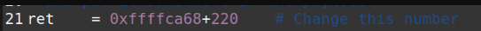

- Agora, só precisamos de encontrar exatamente onde está o return address para que possamos escrever o ret lá. 
Para isso, subtraímos o &buffer a $ebp, e verificamos que o $ebp estava situado 156 bytes acima do endereço inicial do buffer (buffer[0]), o que significa que está em buffer[156]. Como o $ebp é seguido pelo endereço de retorno, sabemos que o endereço de retorno corresponde a buffer[160].

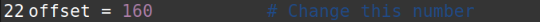

- Desta forma, conseguimos enganar o sistema para executar o shellcode em vez de seguir o fluxo normal do programa.

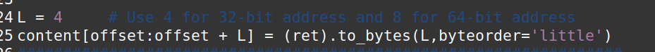

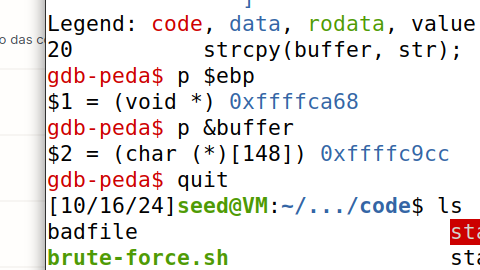

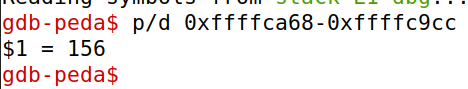

- Agora, executamos stack-l1 e após executar este script, obtemos um root shell, uma vez que stack.c é um programa Set-UID com permissões root.

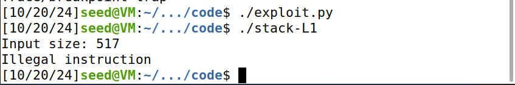
*O resultado de várias tentativas de adivinhar*

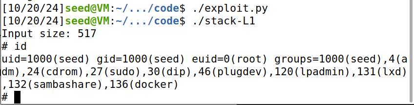

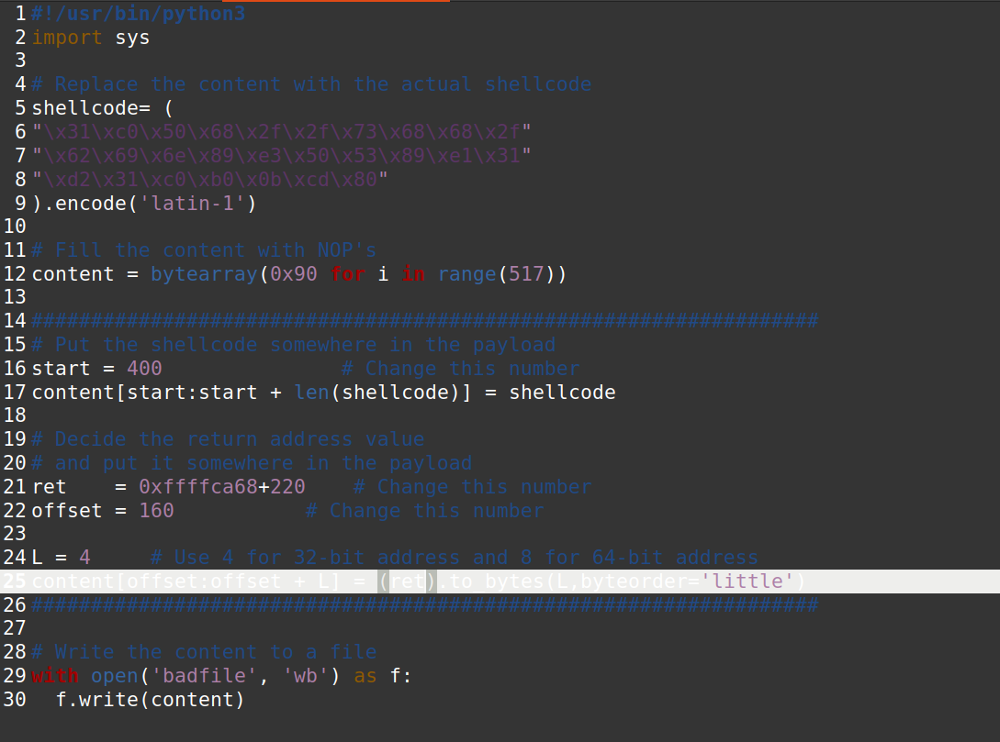

## Questão 2

- Nesta tarefa, exploramos uma vulnerabilidade de buffer overflow num programa alvo, injetando shellcode. Após criar com sucesso um ficheiro badfile para realizar o ataque, usamos o GDB para inspecionar a região de memória afetada pelo overflow. Isto permite-nos identificar na stack a localização (endereços), onde se encontra o shellcode e o endereço de retorno, que é modificado para apontar para o shellcode, possibilitando a sua execução. Para tal, no terminal gdb, criamos um breakpoint na função bof() e corremos o código, dando next até encontrarmos 0x90 como valor dos endereços, o que significa que a função strcopy() foi executada e que ocorreu o buffer overflow. Finalmente executamos o comando x/200xw &buffer, que nos permitiu verificar 800 bytes de memória a começar pelo endereço do buffer.

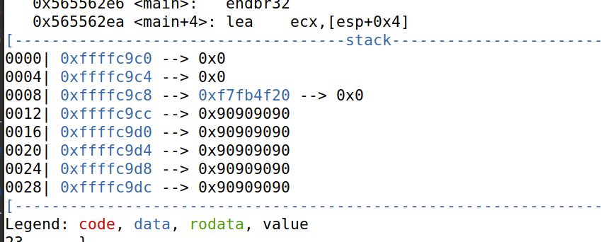

- Ao inspecionarmos os registos do buffer após a execução da função strcopy, conseguimos encontrar perfeitamente o valor correspondente ao shellcode em formato little endian no registo 0xFFFFCB5C .

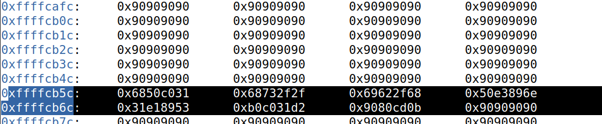

- Além disso, há outro valor que se destaca no endereço 0xFFFFCA6C, este valor corresponde ao endereço de retorno que manipulámos. Ao analisar os registos exibidos, notamos que este endereço está ligeiramente antes do nosso shellcode, confirmando assim a teoria por trás deste ataque.

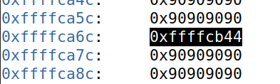