# Trabalho realizado na Semana #6

## Setup

- Primeiramente executámos o seguinte comando de forma a conseguirmos mais tarde ver a ordem e localização de endereços do programa, assim como um comando para criar os containers para os dois terminais que precisamos.

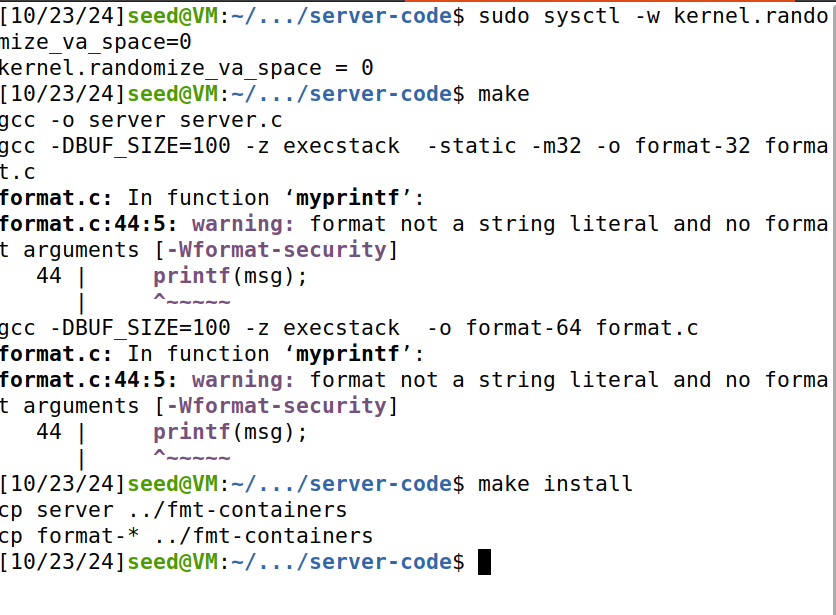

- Após isso, acabámos de construir os dois containers e pusemo-los a correr.

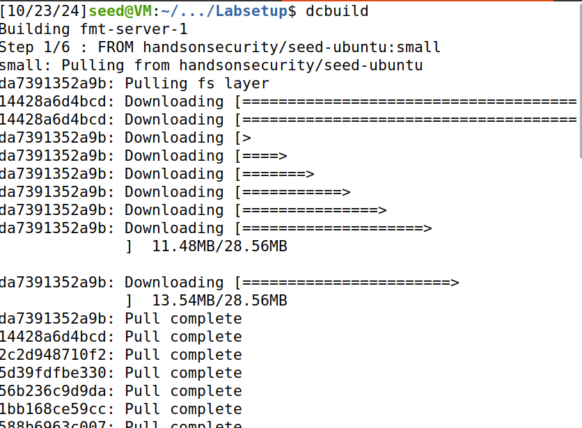

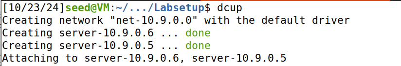

- Terminado esses primeiros passos conseguimos averiguar os endereços de ambos os servidores.

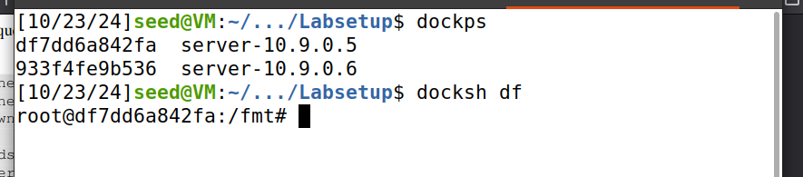

## Questão 1

### Task 1

- A string format "%s" é suficiente para fazer o servidor crashar, já que o printf interpreta "%s" e tenta aceder o próximo valor da stack, assumindo que este seja um endereço que aponta para uma string. Muitas vezes, este endereço é inválido, o que resulta numa segmentation fault, o que faz com que o servidor crashe.

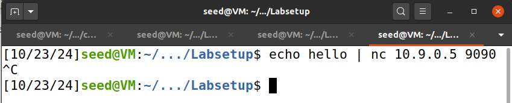

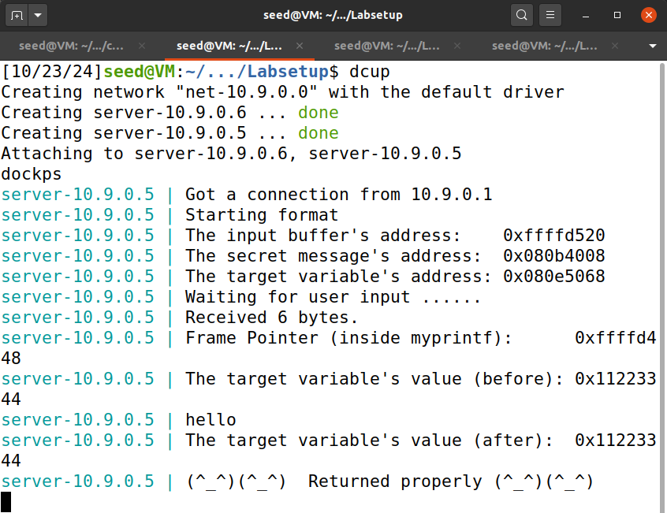

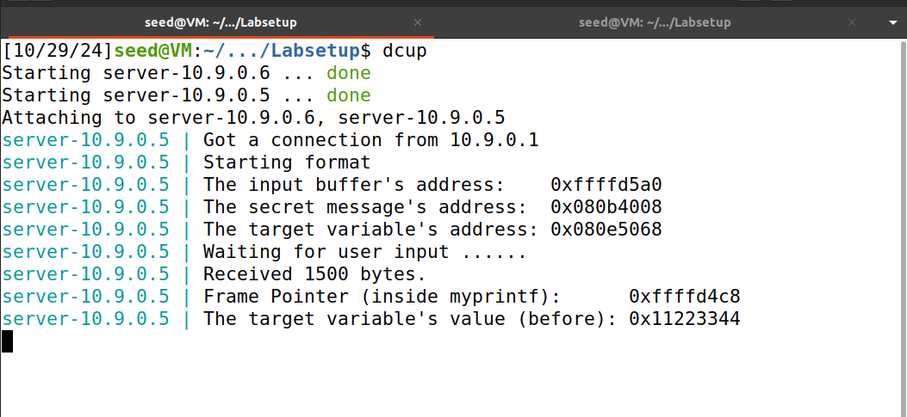

### Task 2 A

- Nesta task era pretendido, dar print aos 4 primeiros bytes do nosso input. Para tal, utilizamos uma string conhecida, "ABCD", e com valor hexadecimal 41424344. 

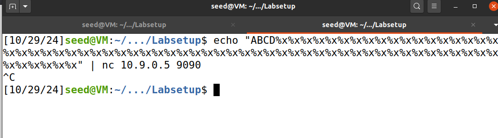

- Utilizando 64 "%x" conseguimos obter o valor 44434241, que é o valor hexadecimal dos 4  primeiros bytes do nosso input de forma invertida.

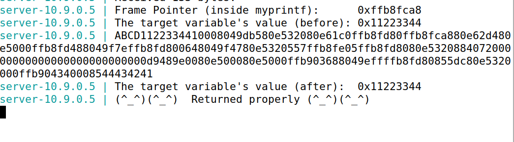

### Task 2 B

- Analisando o printout do servidor encontramos, como indicado, o endereço da mensagem secreta. 

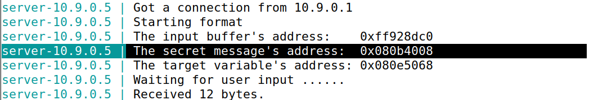

- De modo a descobrir a mensagem secreta, transformá-mos o endereço em little-endian e utilizamos a flag "-e", para que a função echo conseguisse ler o endereço no input. No fim do nosso echo colocamos o placeholder "%s" que permitiu ler o conteúdo no endereço. 

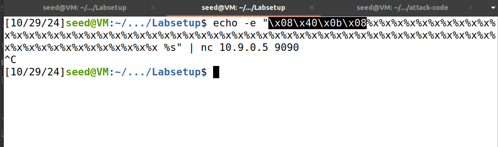

- Com isto obtivemos, a mensagem secreta escondida na heap area

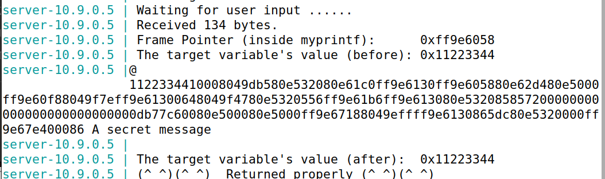

### Task 3 A

- Analisando o printout do servidor encontramos, como indicado, o endereço do target.

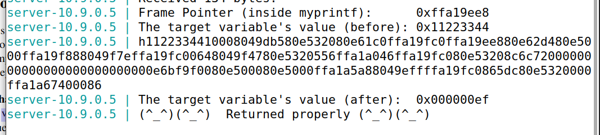

- Transformamos este entreço em little-endian para que o nosso echo o conseguisse interpretar. No fim do nosso echo colocamos o placeholder "%n" que altera o valor do contéudo no endereço para o número de caracteres que foram impressos até então.

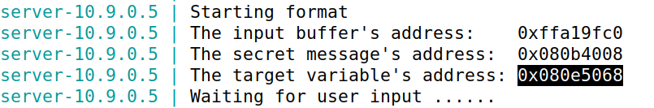

- Com isto observamos que o valor no target adress foi de 0x11223344 para 0x000000ef.

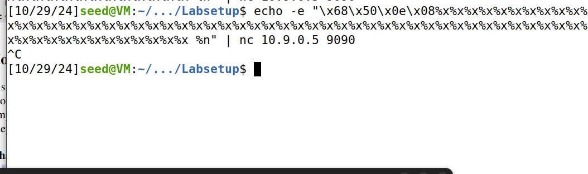

### Task 3 B

- De modo a colocar o valor 0x5000, 20480 em decimal, no endereço 0x080E5068 tínhamos de garantir primeiro em dar output a 20480 caracteres e depois usar o %n. Para tal, como já sabíamos que tínhamos de usar 62 vezes %08X, já que estamos a usar uma arquitetura de 32 bits e existem 63 endereços entre o string format e o buffer, tínhamos, assim, como garantido a output pelo menos 496 (62*8) caracteres. Subtraindo (4 + 496) aos 20480, obtemos o número de caracterers que nos falta escrever.  Assim, o primeiro %08X tem de ser substituído por %.19980X.

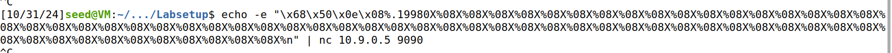

- Obtivemos então o resultado final experado.

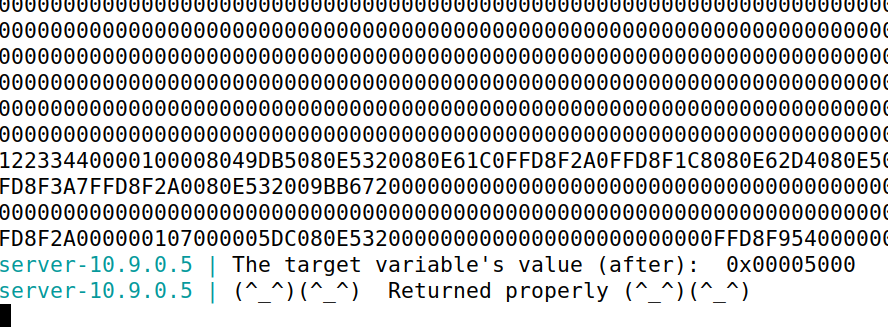

## Questão 2

- Após análise do CWE-134, concluimos que ao longo deste lab exploramos vários pontos desta fraqueza, mais precisamente:

-> ler informaçao da stack: %x foi utilizado para imprimir informação dos endereços da stack.
-> escrever nos endereços de memória: %n foi utilizado para alterar o valor no endereço fornecido de memória.

- Neste sentido, a maioria dos ataques realizados do guião seria na mesma possível com o string format alocada na heap em vez de na stack. Apenas a task 2.A não funcionaria, já que, não sabendo o endereço de memória onde está alocado o valor em questão, iríamos estar a percorrer apenas os valores na heap, enquanto que o valor está alocado na stack.

- Na task 2.B, 3.A e 3.B iríamos conseguir, na mesma, realizar os ataques, já que o endereço de memória é conhecido.