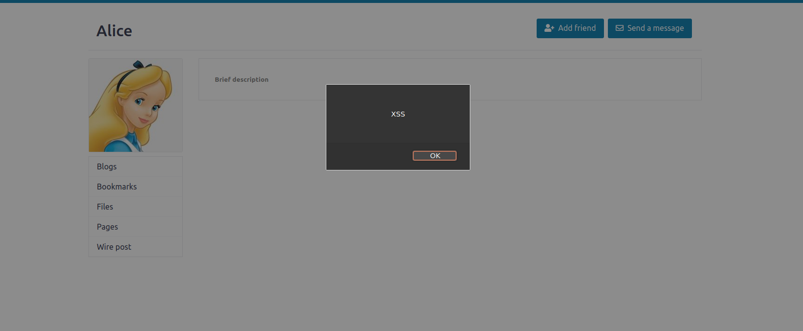
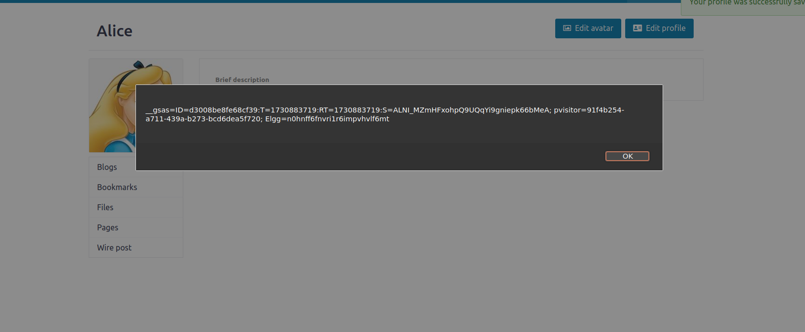
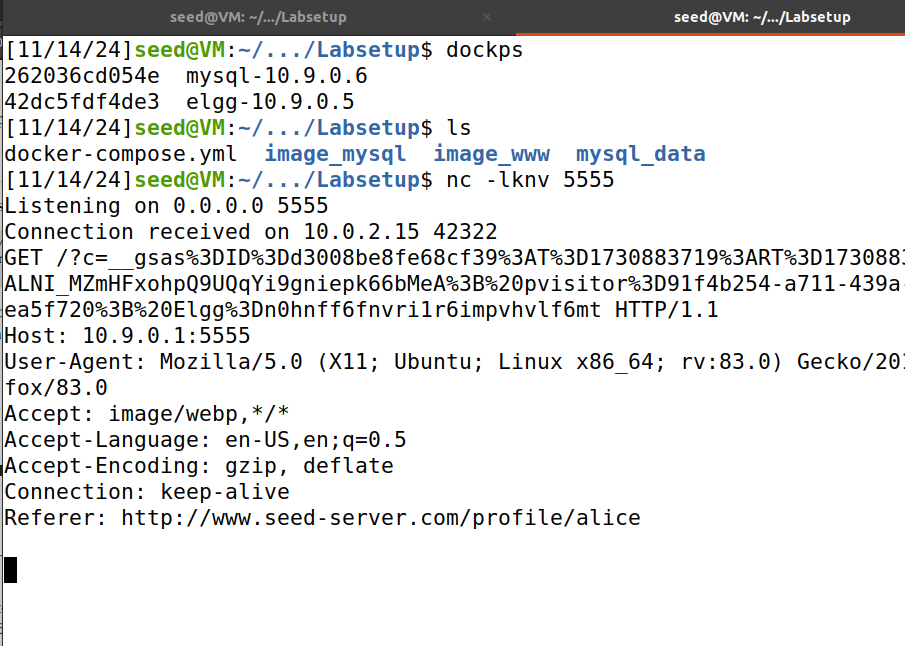
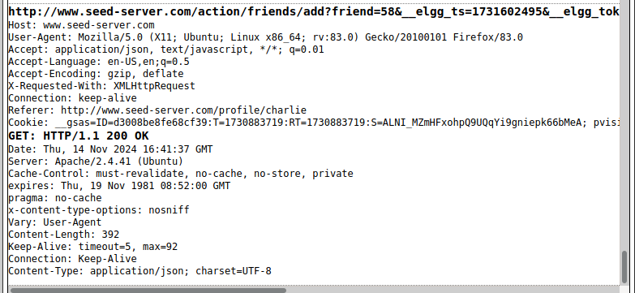
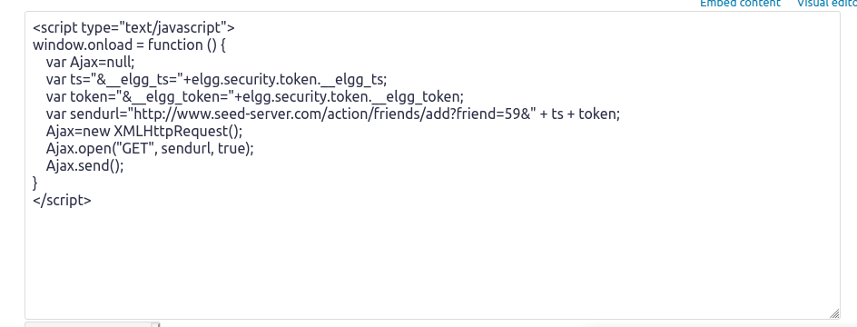
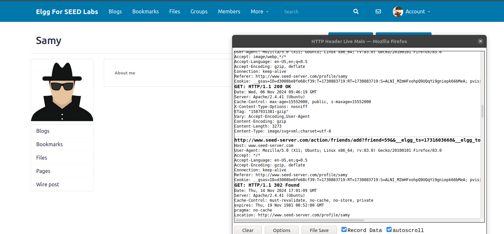

# Trabalho realizado na Semana #7

## Questão 1

### Task 1

- Nesta task utizamos o código fornecido, para provocar um alert em qualquer usuário que acedesse ao nosso perfil malicioso. Ao colocar o código na "brief description" do perfil, este é alocado na base dados e sempre que a página é gerada, esta descrição é lida e excutada da base de dados como um script. 

### Task 2

- Nesta task, a ideia foi igual à da task anterior, mas o script revelava à vítima os seus cookies.

### Task 3

- Nesta task foi pretendido enviar as cookies da vítima ao utilizador malicioso. Para isso, utilizamos um script que tenta inserir uma imagem (<'img'>) com atributo url destinado à máquina do atacante. Assim, quando o browser tentasse carregar a imagem do atributo url, isto resultava num pedido HTTP GET que enviaria os cookies ao atacante, que estaria à escuta na mesma port do url.
- Nota: no atributo url está presente o ip da máquina do atacante e a port de que ele pretende escutar.

### Task 4

- Para começar analisamos o funcionamento de uma HTTP request de um pedido de amizade, de modo a alterar o url do código fornecido (sendurl). 

- Concluímos então que o url desta request tem o seguinte formato http://www.seed-server.com/action/friends/add?friend=USER_ID&" + ts + token.

- Finalmente entramos na conta de outro utilizador, acedemos ao perfil do Sami e verificamos que a HTTP request de pedido de amizade foi efetuada e que, de facto, o Samy foi adicionado.

#### Pergunta 1

- No Elgg, os tokens de segurança (__elgg_ts e __elgg_token) são usados para prevenir ações não autorizadas ou maliciosas. Estes tokens funcionam como uma medida de segurança, exigindo que cada pedido contenha tokens únicos e válidos para ser processado pelo servidor. Ao incluir estes tokens no URL do pedido, o script garante que o pedido falsificado para adicionar um amigo pareça autêntico e seja aceite pelo servidor.

#### Pergunta 2

- Caso a aplicação Elgg apenas disponibilizásse o modo editor, ainda seria possível executar o script, mas seria mais complicado, requerendo métodos alternativos.

## Questão 2

- Os ataques efetuados inserem-se na categoria de XSS stored, já que o script malicioso é armazenado na base de dados, e apenas é executado quando o atributo onde se ele se encontra é utilizado.

