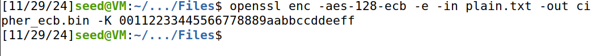
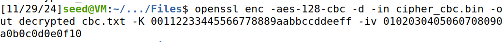

# Trabalho realizado na Semana #9

### Task 1

- Primeiramente, analisámos o texto inicial cifrado usando o script "freq.py", que nos ajudou a identificar os padrões de frequência de letras únicas, bigramas e trigramas.

- Após detetarmos os tais padrões, fizemos várias substituições consecutivas no texto usando o comando 'tr', o que permitiu substituir letras do texto cifrado pelas mais prováveis de serem correspondentes com o texto original.

- À medida que iamos realizando estas substituições e revendo as frequências, o texto começou a ficar cada vez coerente e compreensível, ao que fizemos a substituição de mais algumas letras para corrigir alguns pequenos erros ainda.

- Tendo feito isso, com mais algumas iterações, obtivemos então um texto completamente decifrado e compreensível.
    

- Tendo em conta todas as alterações que realizamos, escrevemos o comando que decifra totalmente a cifra utilizada.

### Task 2

- Primeiramente, criamos o arquivo de entrada "plain.txt" com dados aleatórios, com o comando 'dd'.

- De seguida, fizemos então a cifragem usando o **modo 'aes-128-ecb'**, que não utiliza vetor de inicialização, ou 'IV', o que o torna um pouco menos seguro quando se trata de padrões repetitivos nos dados. Tivemos de usar a flag '-K'.

- Depois disso, fizemos a cifragem no **modo 'aes-128-cbc'**, que utiliza o vetor de inicialização, o que nos obriga a usar a flag '-iv', para além da que usámos anteriormente ('-K'). Isto permite-nos mascarar melhor padrões repetitivos, o que era a vulnerabilidade principal do modo anterior.

- Finalmente, usámos o **modo 'aes-128-ctr'**, que cria um fluxo de cifra, o que elimina padrões repetitivos e permite uma maior flexibilidade. Tivemos de usar, assim como no modo anterior, as flags '-K' e '-iv'.

- O próximo passo na task seria decifrar agora cada modo, verificando se recebíamos o arquivo original. No primeiro modo, o **'aes-128-ecb'**, tivémos que usar apenas a flag '-K', enquanto que nos outros dois usámos, assim como na cifragem, as flags '-K' e '-iv'.

- A principal diferença que observámos e aprendemos entre o modo **'aes-128-ctr'** para com os outros, foi que ambos os outros dois "trabalham" à volta de blocos de cifra, sempre limitados pela existência de padrões reptitivos, mesmo que o modo **'aes-128-cbc'** os torne mais protegidos, enquanto que o modo **'aes-128-ctr'** troca o algoritmo de blocos por um de fluxo de cifras, o que elimina completamente padrões repetitivos e melhora a flexibilidade.

### Task 5

- Nesta task, como pedido, utilizamos o ficheiro da task 2(plain.txt) de modo a analisar os efeitos de corromper um byte de texto cifrado, para as cifras ECB, CBC e CTR. Alteramos para isto o byte 0x12C (50 * 6)

1. **AES-128-ECB**:

**Observações:** Coromper o byte afetou vários bytes no ficheiro decifrado, já que neste modo os limites dos blocos são fixos, o pode levar a corrupção o impactar os bytes ao seu redor.

2. **AES-128-CBC**:

- A corrupção do byte leva a que, para além do próprio, o próximo seja corrompido. Isto é causado pelo mecanismo de encadeamento do CBC.

3. **AES-128-CTR**:

**Observações:** Neste modo apenas o próprio byte é afetado, já que este modo de cifra é de fluxo.

### Conclusões

- Com isto é possível concluir que diferentes modos de cifra lida de maneiras diferentes com a cifra, sendo o CTR o mais isolado, já que, ao contrário dos outros, não se baseia em blocos.
